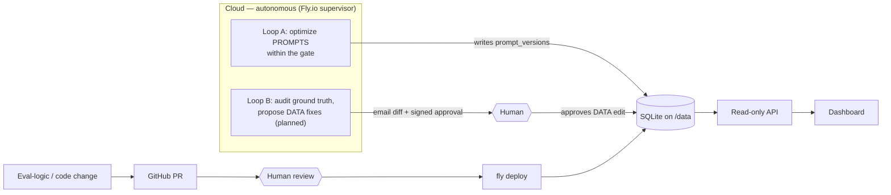

# PromptLab

Observability dashboard **and** autonomous prompt-optimization engine for **3ie's Development
Evidence Portal (DEP)** LLM data-extraction pipeline. It extracts structured metadata — authors,
author affiliations, author-institution countries, sector, sub-sector — from impact-evaluation
studies, scores every model against a human-curated ground truth, and **continuously improves the
prompts on its own, in the cloud**.

- **Frontend** (this repo root): React + Vite + TypeScript dashboard.
- **Backend** (`backend/`): FastAPI **read-only** API + scoring / optimizer / supervisor engine
  over a SQLite DB. See [`backend/README.md`](backend/README.md) for the full architecture and the
  detailed pipeline diagram.
- **Forward-looking plans**: [`ROADMAP.md`](ROADMAP.md).

## Architecture — two loops, different autonomy

The agent moves **prompts** on its own, but **data** (ground truth / taxonomy) and **code /
eval-logic** changes stay human-gated, so it can never edit its own answer key or scoring rules to
game the metric:



The inner **extract → score → judge → gate → optimize → advance** loop (Loop A, run by the
`supervisor` daemon) is documented with its own diagram in
[`backend/README.md`](backend/README.md#architecture) and in the dashboard's "How to read this
dashboard" panel.

## What the dashboard shows

Metrics are tiered so the one that matters leads:

- **Quality gate (per model)** — the production metric: **F1** for list fields (authors,
  affiliations, countries) and **accuracy** for categorical fields (sector, sub-sector); a
  (field, model) is production-ready at **≥ 90%**.
- **Explains the gate** — precision & recall (lists) or **Cohen's κ** (categorical), with 95%
  Wilson confidence intervals.
- **Corroboration** — cross-family **LLM-judge concordance**; confidence **calibration** (Brier).
- **Honesty** — abstain / wrong / hallucination mix and an honesty-adjusted score (which *steers
  the optimizer*), plus excerpt-verification (anti-fabrication).
- **Efficiency** — cost per model and an **EcoLogits-estimated CO₂e** footprint.
- **Comparisons** — sortable model table, a **quality leaderboard**, a **cost-vs-quality**
  frontier plot, confusion matrices, and prompt lineage + optimizer-progress charts.

## Development

```bash
npm install
npm run dev        # http://localhost:5173/promptlab/
```

The frontend reads from the API at `VITE_API_BASE_URL` (defaults to the local dev server
`http://127.0.0.1:8000`; in production it points at the Fly.io deployment). Start the backend with
`python -m backend.scripts.serve` — see [`backend/README.md`](backend/README.md).

## Deploy

- **Frontend** → GitHub Pages, on push to `main`.
- **Backend** → `fly deploy` (always-on Fly.io app; the autonomous supervisor daemon runs there).
  The full build → rollout → deploy sequence is in
  [`backend/README.md`](backend/README.md#production-deployment-flyio).
