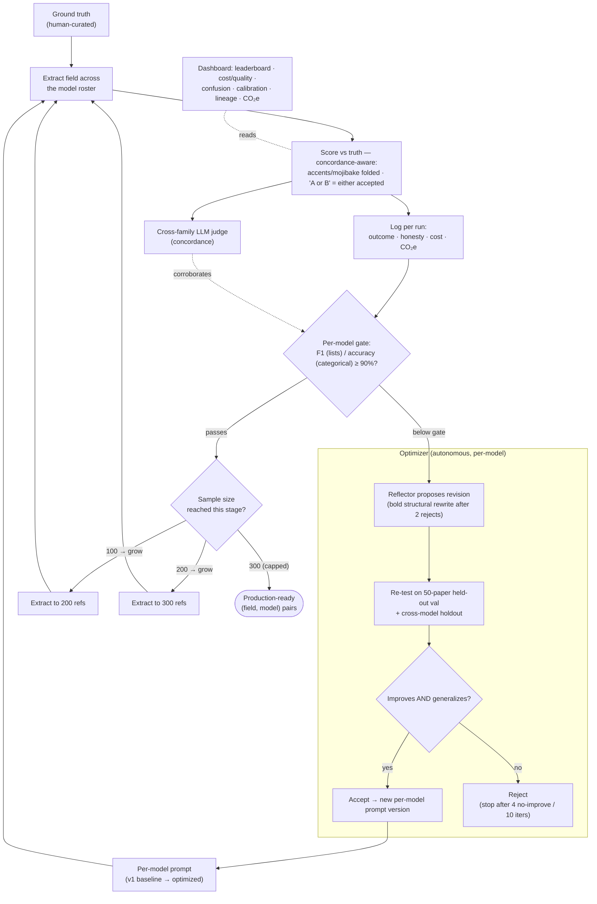
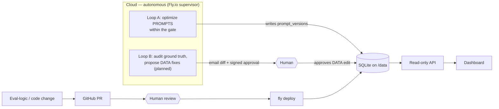

# Agentic 3ie Prompt Lab — backend

Agentic system to iteratively refine LLM prompts for 3ie's evidence-synthesis pipeline
(TAS -> FTS -> data extraction). Multi-project aware (see "Multi-project support" below): today
only one project is registered, `dep-extraction`, covering the **data extraction** step for 5
metadata fields: `authors`, `author_affiliation` (institution), `author_country`, `sector_name`,
`sub_sector`.

Stack: FastAPI + SQLite (no task queue), OpenRouter as a single unified model gateway (free ->
expensive tiers), plateau-based stopping ("stop after N iterations with no improvement") for the
prompt optimizer.

## Setup

```
cd backend
copy .env.example .env      # then edit .env and paste your OpenRouter API key
cd ..
.venv\Scripts\python.exe -m backend.scripts.build_ground_truth
.venv\Scripts\python.exe -m backend.scripts.run_extraction --field sector_name --n 5 --tiers free
```

## Architecture

The end-to-end **autonomous** loop — extract → score → judge → gate → (optimize | advance) — runs
in the cloud via the supervisor daemon (no laptop required):



Two loops share the DB at different autonomy levels — the agent moves **prompts** on its own, but
**data** (ground truth / taxonomy) and **code / eval-logic** changes stay human-gated, so it can
never edit its own answer key or scoring rules to game the metric:



- **Projects** (`app/projects.py`): a `ProjectSpec` (slug, name, description, fields) registers a
  synthesis project — today just `dep-extraction`. Adding a new project (HSF, Girl Effect,
  StrongMinds) means adding its own `FieldSpec` dict (mirroring `app/fields.py`) and registering a
  `ProjectSpec` for it in `PROJECTS` — no schema changes needed. `db.sync_projects()` upserts the
  Python registry into the `projects` table on every `init_db()` call, so a new project just needs
  a code change + restart. Every other table (`records`, `ground_truth`, `prompt_versions`,
  `runs`, `iterations`, `jobs`) is scoped by a `project_id` FK, so each project has fully
  independent corpus/ground-truth/prompt/run history while sharing the same DB file and API.
- **Ground truth**: `1770900869-ier-records.xlsx` joined against the QA'd markdown corpus
  (`..._ok_only_final`, files named `<id>.md`) by numeric `id`. 7,675 studies have both. Build/
  refresh with `python -m backend.scripts.build_ground_truth`, which writes to
  `backend/data/promptlab.db` (SQLite; gitignored).
- **Taxonomy**: sector/sub-sector/country controlled vocabularies extracted from the protocol
  workbook's `Lists` sheet into `backend/app/data/taxonomy.json`. Regenerate with
  `python -m backend.scripts.extract_taxonomy`.
- **Model gateway** (`app/gateway.py`): one `call_model(model_id, system, user, ...)` function
  against OpenRouter's OpenAI-compatible endpoint. Requires `backend/.env` with
  `OPENROUTER_API_KEY` (copy `.env.example`; never commit the real key).
- **Model roster** (`models.yaml`): where available, paid tiers use OpenRouter's
  `~author/family-latest` alias resolution (leading `~` is part of the literal model id) so the
  roster picks up each provider's newest release automatically. No alias exists yet for Grok,
  GLM, Mistral, DeepSeek, Qwen, or Meta-Llama — those stay pinned and need refreshing by hand.
- **Prompt templates** (`app/prompts.py`): v1 baseline templates per field (anchor/excerpt before
  value, typed placeholders, one null convention, `<paper>` instruction/data separation with an
  injection guard).
- **Scorer** (`app/scoring.py`): field-type aware — exact/fuzzy match for single categorical
  fields (sector, sub-sector), set-based F1 with fuzzy name matching for list fields (authors,
  institutions), exact set match for list-categorical (countries). All comparisons are
  **concordance-aware**: accents/mojibake are folded and transliterated (so `José`≡`Jose`,
  `Lønborg`≡`Lonborg`) and a `|`-joined ground-truth value (curators tagged two equally-valid
  labels) counts correct if the model matches *either*. Each run is also tagged with
  an `outcome` (`hit` / `correct_abstain` / `abstain_miss` / `wrong` / `hallucination`) and a
  separate `honesty_score`. The raw `score`/`is_correct`/accuracy numbers are unchanged (so
  historical aggregates stay comparable); the honesty-adjusted score gives partial credit
  (`ABSTENTION_CREDIT`, default 0.5) for an *honest abstention* — the model returning null/empty
  ("I don't know") when a value existed, or for list fields under-reporting without inventing
  wrong extras — so a confident wrong guess and a hallucination score strictly worse than honest
  uncertainty. It also runs an **excerpt-verification** check (`verify_excerpt`): the cited
  verbatim `excerpt` is looked for in the source text (normalized substring, then fuzzy
  `partial_ratio` >= `EXCERPT_MATCH_THRESHOLD`); if a value was given with an excerpt that isn't
  in the source (fabricated evidence), its `honesty_score` is docked by `EXCERPT_PENALTY` (0.5) —
  raw accuracy untouched, so the optimizer is pushed toward prompts that quote real text.
- **Run harness** (`scripts/run_extraction.py`): samples N ground-truthed records, runs every
  configured model (`models.yaml`) against the current baseline/accepted prompt, scores + stores
  every run in SQLite (with per-run `cost_usd` and an EcoLogits-estimated `co2e_grams` footprint),
  prints a comparison table. Every script that touches the DB accepts
  `--project <slug>` (default `dep-extraction`). Example:
  ```
  python -m backend.scripts.run_extraction --field sector_name --n 20 --tiers free,cheap
  python -m backend.scripts.run_extraction --field authors --n 15 --models openai/gpt-4o-mini,anthropic/claude-3-5-haiku
  ```
- **Optimizer loop** (`app/optimizer.py`): GEPA-lite — evaluate on a minibatch, reflect on
  wrong/low-score runs (avoiding previously-tried dead ends), propose up to N candidate revisions
  per iteration (best-of-N), validate each on a held-out set, accept only the winner if it beats
  the incumbent by more than `IMPROVEMENT_EPSILON`, stop after N iterations with no improvement.
  Run via `scripts/optimize_prompt.py` (single field+model+reflector at a time) or
  `scripts/optimize_all.py` (sweeps every field x model combination in one run, picking a
  cross-family reflector automatically — Anthropic models are reflected on by `~openai/gpt-latest`,
  everything else by `~anthropic/claude-opus-latest`, so a model is never self-critiqued by a
  same-family model; one failing pair doesn't stop the sweep). Prompts are **per-model** (each
  model optimizes its own lineage, falling back to a shared v1 baseline until it diverges). A
  rewrite is **accepted only if it (a) raises the gate metric** — F1 (list fields) / accuracy
  (categorical), the **same** `app/analytics.gate_metrics` the production gate uses — on a fixed
  **50-record held-out val set** **and (b) does not regress** that metric on a separate **held-out
  set across the optimized model + a cheap different-family reference** (a **cross-model
  generalization gate** that blocks single-model overfits). After `bold_after` (2) consecutive
  rejections it switches to **bold** mode (structural rewrites, shown the cases the prompt already
  gets right); it stops after `no_improve_limit` (4) non-improving iterations. The cheap
  honesty-adjusted score only *ranks* candidates within an iteration, and LLM-judged accuracy is
  kept as a reported corroborating companion — so "what the optimizer chases" == "what the gate
  checks" (both are F1/accuracy ≥ `GATE_THRESHOLD` 0.90).
- **Autonomous supervisor** (`scripts/supervisor.py`): the always-on orchestrator ("Loop A"). Each
  cycle it reads per-(field, model) state and picks one action — extract the next rollout stage,
  judge unjudged runs, optimize a below-gate model on its own prompt lineage, or advance — shelling
  out to the tested `run_extraction` / `llm_judge` / `optimize_prompt` scripts. Deployed as a
  `--loop` daemon on Fly so the pipeline runs without a laptop; self-terminating via the guardrails
  (`MAX_PRODUCTION_RECORDS`, `PRODUCTION_ROLLOUT_STAGES`, `no_improve_limit`).

  **Concurrency / parallelism rules (critical — do not violate):**
  - `--parallelism N` controls how many **extraction** subprocesses run concurrently. Each
    `run_extraction --models <single-model>` call makes short, model-isolated writes (one row per
    result) that commit immediately, so N concurrent writers are safe with WAL mode + `timeout=30`.
  - **Optimization is always sequential**, regardless of `--parallelism`. The reason:
    `_run_optimization` in `optimizer.py` opens a single `get_conn()` block that wraps the entire
    multi-iteration loop (up to 10 iterations × LLM API calls). This holds a SQLite write
    transaction open for **10–60 minutes**, starving every other writer with `SQLITE_LOCKED`. The
    parallelism benefit for optimization is marginal anyway — the bottleneck is LLM API latency,
    not process scheduling, and each model's optimization is already internally concurrent via
    `gateway.call_model_batch`.
  - **Judging is a single call** (not split per model) and runs sequentially. It is already
    internally concurrent (`--concurrency` controls parallelism within the call).
  - DB concurrency settings: `sqlite3.connect(timeout=30)` + `PRAGMA journal_mode=WAL` +
    `PRAGMA busy_timeout=30000`. WAL allows concurrent reads with one writer; `timeout=30` makes
    Python wait up to 30 s before raising `OperationalError: database is locked`.
- **Ground-truth audit** (`scripts/audit_ground_truth.py`, `scripts/propose_gt_fixes.py`):
  read-only diagnostics (no model calls, no DB writes) that flag reference-data issues (encoding,
  name-order, values outside the taxonomy, duplicates, rare categories) and propose canonical
  fixes for human review — the input to the planned data-quality loop ("Loop B"); see
  `../ROADMAP.md`.
- **FastAPI app** (`app/api.py`, read-only): every field-scoped route is nested under a project
  slug: `/api/projects`, `/api/projects/{p}/fields`, `/api/projects/{p}/fields/{f}/prompt-versions`,
  `/api/projects/{p}/fields/{f}/models-summary`, `/api/projects/{p}/fields/{f}/runs`,
  `/api/projects/{p}/fields/{f}/iterations`, `/api/projects/{p}/fields/{f}/confusion`,
  `/api/projects/{p}/fields/{f}/jobs`, `/api/projects/{p}/fields/{f}/llm-judge-summary`,
  `/api/projects/{p}/fields/{f}/cross-model-agreement`,
  `/api/projects/{p}/fields/{f}/self-consistency`, `/api/projects/{p}/fields/{f}/calibration`,
  plus the project-agnostic `/api/config/thresholds`. Run with
  `python -m backend.scripts.serve` (http://127.0.0.1:8000).
- **Confidence signals** (how *sure* an answer is, separate from whether it's correct): (1)
  **token confidence** — `run_extraction.py --logprobs` requests per-token logprobs and stores a
  per-run `logprob_confidence` (mean token probability; null for providers that don't expose it);
  (2) **cross-model agreement** — the `cross-model-agreement` endpoint computes, from existing
  runs, how often each model's value matches the other models on the same record (no extra API
  calls); (3) **self-consistency** — `scripts/self_consistency.py` samples the same (record, model)
  prompt N times at temperature>0 and records the modal-answer agreement rate into the
  `self_consistency` table (opt-in validation study, N× calls, surfaced via the `self-consistency`
  endpoint); (4) **verbalized confidence + calibration** — the JSON contract asks each model for a
  0-1 `confidence` (stored on every run); the `calibration` endpoint scores it with the **Brier**
  score (mean squared error vs. `is_correct`, a proper scoring rule) plus reliability-diagram bins,
  so an overconfident model is caught. Confidence is a posterior diagnostic only — never folded
  into the per-run score.
- **Job tracking** (`db.start_job`/`update_job_progress`/`finish_job`, `jobs` table): both
  `run_extraction.py` and `optimize_prompt.py` record a `jobs` row (per field+model) when they
  start and mark it completed/failed when they stop, so the dashboard can show a "currently
  running" banner + per-model badge while a batch is in flight. `run_extraction.py` fires every
  (record, model) call in one big concurrent batch, so its progress only ever jumps 0 -> total (no
  granular per-record updates); `optimize_prompt.py` updates progress once per iteration. A
  "running" job whose `updated_at` is older than `db.JOB_STALE_AFTER_SECONDS` (5 min) is reported
  by the API as `stale: true` instead of trusted at face value, in case the script crashed/was
  killed without ever calling `finish_job`.
- **Observability frontend**: separate repo/deploy (`promptlab`, React + Vite), fetches from the
  FastAPI app above (either the local dev server, or the always-on Fly.io deployment — see
  "Production deployment" below). CORS is opened for both the Vite dev origin and the deployed
  GitHub Pages origin. Polls `/api/fields/{f}/jobs` every 6s while a field is selected to drive
  the running-job banner/badges.

## When is a field "done"? (stopping criteria)

The pipeline has explicit, no-manual-state stopping rules — "good enough" and "run long enough" are
both defined:

- **Good enough (per field, model):** the pair clears the **gate** — F1 (list fields) / accuracy
  (categorical) **≥ 0.90** — with a **tight 95% Wilson CI** (a wide band means "not enough references
  yet", not necessarily a bad model).
- **Run long enough (per field):** the staged rollout is **capped at 300 references**
  (`MAX_PRODUCTION_RECORDS`, stages 100→200→300); the optimizer **stops after 4 consecutive
  non-improving iterations** (or 10 total); and the supervisor reports **"converged"** once every
  (field, model) either passes the gate or is optimizer-exhausted, after which it idles and spends
  nothing.
- **Caveat:** "good enough" is bounded by **ground-truth quality** — the human reference standard is
  itself error-prone (benchmark bias; ~60%+ of human extractions contain ≥1 error in the
  literature), and **0.90 is a policy choice**, not a law (per-field, evidence-supported thresholds
  are on the roadmap). A field stuck below the gate is often a signal to fix the *data*, not the
  prompt.

## Human oversight (human-on-the-loop)

This system **reduces** human effort by automating the extract → score → judge → optimize loop; it
does **not remove the human**. Human judgement stays load-bearing at these points — the machine does
the repetitive work in between and *surfaces* the cases that need a person:

1. **The model is unsure → abstains.** Honesty scoring rewards an honest "I don't know" over a
   confident wrong guess (abstention credit 0.5) and tags it `abstain_miss` — a value existed, the
   model punted, a human fills it in.
2. **A field can't clear the gate ("stuck").** The optimizer exhausts its attempts and the pair is
   left *gated* → "needs prompt / ground-truth work."
3. **Ground-truth correction (Loop B).** Humans approve the GT/taxonomy fixes the audit proposes;
   the strongest trigger is **all models agree but disagree with the ground truth** → the answer key
   is probably wrong.
4. **Fabricated-evidence flag.** A cited excerpt not found in the source is flagged even when the
   answer looks right.
5. **Confidence red flags.** Low self-consistency, cross-model disagreement, or poor calibration.
6. **Policy / thresholds.** Humans set the gate, rollout size, abstention credit, per-field metric —
   the agent can't move its own bar.
7. **Code / eval-logic changes.** Always PR → human review → deploy; the agent can never edit its own
   scoring or answer key.
8. **Final sign-off** of the production dataset, and **new-project onboarding** (defining fields,
   taxonomy, and the initial ground truth).

Today the dashboard **surfaces** these cases; routing them into an explicit human-review *queue* is
on the roadmap. So the honest claim is **human-*on*-the-loop** — humans own the rules, the answer
key, and adjudicate uncertainty/disagreement — not "no human needed."

## Data model (SQLite)

`projects(id, slug, name, description, created_at)` ·
`records(project_id, id, title, md_path, PRIMARY KEY(project_id, id))` ·
`ground_truth(project_id, record_id, field_name, value_json)` ·
`prompt_versions(id, project_id, field_name, version, template, parent_id, notes, accepted,
model_id, created_at)` (`model_id` scopes a lineage to one model; NULL = shared baseline) ·
`runs(id, project_id, prompt_version_id, model_id, record_id, field_name,
raw_response, parsed_value_json, excerpt, notes, score, honesty_score, is_correct, outcome,
logprob_confidence, excerpt_verified, confidence, latency_ms, prompt_tokens, completion_tokens,
cost_usd, co2e_grams, error, batch_id, created_at)` (`excerpt` = verbatim source line cited, `notes` =
free-text uncertainty, `honesty_score` = abstention-credited score used by the optimizer,
`outcome` = hit/correct_abstain/abstain_miss/wrong/hallucination, `logprob_confidence` = mean
token probability when logprobs requested, `excerpt_verified` = whether the cited excerpt was
found in the source, `confidence` = the model's self-reported 0-1 confidence, `co2e_grams` =
EcoLogits-estimated grams CO₂e per call) ·
`iterations(id, project_id, field_name, iteration_num, prompt_version_id, model_id, mean_score,
n_records, feedback, accepted, created_at)` · `llm_judgments(id, run_id, judge_model, verdict,
reasoning, created_at)` · `self_consistency(id, project_id, field_name, model_id, record_id,
n_samples, agreement, modal_value_json, created_at)` · `jobs(id, project_id, field_name,
model_id, kind, status, total, completed, started_at, updated_at, finished_at, error)`.

An older single-project DB (no `project_id` columns) is migrated automatically the first time
`db.init_db()` runs against it — see `db._migrate_to_multi_project`: adds the `projects` table,
backfills every existing row into a `dep-extraction` project (id=1), and rebuilds
`records`/`ground_truth`/`prompt_versions`/`runs`/`iterations`/`jobs` with the new project-scoped
keys. No data is lost (verified: row counts before/after match exactly); it's a no-op once
already migrated. Additive per-run columns (`excerpt`, `notes`, `honesty_score`, `outcome`,
`logprob_confidence`, `excerpt_verified`, `confidence`) are added in place by `db._migrate`.

## Production deployment (Fly.io)

The dashboard is meant to keep working even when the developer's laptop is off, so the API is
deployed as an always-on Fly.io app serving a **fixed, one-time production dataset** — not the
full 7,675-record local corpus, and not a recurring/scheduled extraction job. Both
`run_extraction.py` and `optimize_prompt.py` are deterministic, self-terminating batch scripts
(fixed `seed=42` sampling, early-stop via `no_improve_limit`); re-running them on a schedule
without changing inputs just re-processes the same records, so there's no cron job here — the
production dataset is built once, by hand, then served read-only forever after.

Files: `Dockerfile`, `fly.toml`, `.dockerignore` at the **promptlab repo root** (the `fly deploy`
build context). The image contains only `backend/app`, `backend/scripts`, `backend/models.yaml`
— **not** the database or corpus, which live on a persistent Fly volume mounted at `/data`, kept
separate so redeploying code never requires re-uploading ~50MB of data.

`backend/app/api.py` never calls the model gateway (it's read-only), so **no `OPENROUTER_API_KEY`
secret is needed on Fly** — the OpenRouter key only ever lives in the developer's local
`backend/.env`, used to build the dataset before it's uploaded.

Building the production dataset (run locally):
```
python -m backend.scripts.export_production_subset
# regenerates backend/deploy/{promptlab.db,corpus/} -- 100 complete-case records
# (config.MAX_PRODUCTION_RECORDS), md_path pointed at the local corpus/ folder so you
# can immediately run a real rollout against it:
$env:DEP_DB_PATH = "<repo>\backend\deploy\promptlab.db"
python -m backend.scripts.run_extraction --field <field> --n 100 --tiers free,cheap,mid,expensive
# repeat per field: authors, author_affiliation, author_country, sector_name, sub_sector
```

Once the local rollout is done and you're ready to actually ship it, rewrite the paths to match
the Fly volume mount before uploading:
```
python -m backend.scripts.rewrite_corpus_path_for_deploy --db backend/deploy/promptlab.db --target-dir /data/corpus
```

One-time Fly setup (from the promptlab repo root):
```
fly auth login
fly launch --no-deploy --copy-config --name <app-name>
fly volumes create dep_data --size 1 --region <region matching fly.toml primary_region>
fly deploy
fly ssh sftp shell   # or `fly ssh console` + scp, to upload promptlab.db + corpus/ into /data
```
Later code-only changes: `fly deploy`. Later data refreshes: repeat the export -> rollout ->
rewrite-paths -> upload sequence above and redeploy (or just re-upload to the existing volume).

Running extraction jobs directly on the Fly machine (so they survive closing your laptop): upload
`OPENROUTER_API_KEY`/`OPENROUTER_BASE_URL` as Fly secrets (`Get-Content backend\.env | fly secrets
import --app <app-name>` — pipes the key in without ever printing it), then kick off
`python -m backend.scripts.run_extraction ...` via `fly ssh console -C "sh /data/<script>.sh"`
(upload a small `.sh` file via `fly ssh sftp shell` first — inline quoting through `fly ssh console
-C` reliably breaks on nested quotes). Check progress later with a
`SELECT COUNT(*) FROM runs WHERE field_name=?` query against `/data/promptlab.db`, run the same
way. **Memory**: the default `shared-cpu-1x`/512MB machine OOM-restarted (silently killing the
background job, no error, just gone) the moment an extraction job ran concurrently with the API
server — bumped to 1024mb in `fly.toml` to fix. A plain `nohup ... &` background job does **not**
survive a Fly machine restart (restarts wipe the whole container; only `/data` persists) — unlike
a local crash, there's no automatic resume, so just re-run the command if a restart happens again.

## Roadmap

> Forward-looking plans live in the repo-root [`ROADMAP.md`](../ROADMAP.md) (the canonical
> roadmap). The entries below are kept for the areas with implementation detail; new
> direction-setting items go in `ROADMAP.md`.

- **Multi-project support (merged to `main`)**: the backend is fully project-scoped (see
  "Projects" in Architecture and the Data model section) — schema + auto-migration,
  `app/projects.py` registry, `/api/projects/...`-nested API, `--project` CLI flag on every
  data-touching script, and the frontend project switcher (`api.ts` calls the nested URLs) are all
  done, merged, and validated locally. Only one project is registered so far (`dep-extraction`).
  Remaining work: (1) `app/prompts.py`/`scoring.py`/`taxonomy.py` are still hardcoded to the single
  `fields.FIELDS` dict rather than being project-aware — generalize when a second real project
  (e.g. a screening project) is actually added; (2) add that second project's fields/corpus/prompts.
- **Honesty-aware scoring, confidence signals & calibration (done, merged)**: per-run `outcome` +
  `honesty_score` (abstention credit + fabricated-excerpt penalty, drives the optimizer), excerpt
  verification, token-logprob / cross-model-agreement / self-consistency signals, and verbalized
  confidence + Brier calibration are all shipped (see Architecture). Update (2026-07-05): the
  production rollout ran extraction to n=100 across all 5 fields × 9 models *with* `--logprobs`,
  and a cross-family `llm_judge.py` pass at n=100 is populating the per-model gate;
  `self_consistency.py` is still optional/TODO.

- **Prompt caching (planned, not started)**: the `<paper>` document block is already the stable
  prefix in every prompt (see `prompts.build_prompt`), and most providers OpenRouter proxies to
  (OpenAI, Gemini 2.5, DeepSeek, Grok) cache a shared prefix automatically, with Anthropic/Qwen
  needing an explicit `cache_control: {"type": "ephemeral"}` marker on that block — cached reads
  cost 10-50% of normal input price depending on provider. The catch: cache TTL is only ~5 min
  (up to 1h for Anthropic), but `run_extraction.py` currently runs *field-major* (all 100 records
  for one field, then the next field), so the same record+model's 5 field calls are hours apart
  and never hit a warm cache. To benefit, execution would need to go *record-major* (loop each
  record, call all 5 fields back-to-back per model) instead. **Before committing to this
  refactor, benchmark it against the current single-request-per-field baseline** — run a small
  side-by-side comparison (same sample of records/models) measuring actual cost via
  `usage.prompt_tokens_details`/`cache_discount` and wall-clock time, record-major+caching vs.
  today's field-major approach, to confirm the savings are worth the iteration-order rewrite
  before changing `run_extraction.py`.
- **LLM-judged accuracy surfaced in the dashboard, but needs a real sweep run (in progress)**:
  added a third accuracy metric (`GET /api/fields/{field}/llm-judge-summary`, a new stat card in
  `ModelCard.tsx`) sourced from `scripts/llm_judge.py`'s posterior semantic true/false verdicts —
  meant to be the most trustworthy of the three accuracy numbers shown (vs. threshold accuracy /
  exact-match accuracy, which are both just string-matching heuristics). The old Fly deployment was
  deleted, so this is no longer blocked on a deferred `fly deploy` — it will just be part of the
  fresh build/rollout. TODO: run `llm_judge.py` across all 5 fields with a bigger sample than the
  earlier 40 references so the metric is meaningful across the whole production dataset.
- **Staged rollout + per-model quality gate (done, 2026-07-05)**: `/api/projects/{slug}/fields/
  {field}/stage-status` derives, with no manual state, how many references a field has reached
  (the current stage vs `config.PRODUCTION_ROLLOUT_STAGES` 100→200→300) and evaluates the quality
  gate **per (field, model)** on a field-type-aware quality metric — **F1** for list fields,
  **accuracy** for categorical — vs `scoring.GATE_THRESHOLD` (**0.90**), returning
  `n_models_passing`/`n_models_evaluated` (LLM-judged accuracy is kept as a corroborating
  companion). The dashboard shows a field badge ("N/M models pass gate") with 95% Wilson CIs that
  narrow as the sample grows, plus a per-model gate chip. The gate is computed at read time from
  `runs` + ground truth via `app/analytics.gate_metrics` (with Cohen's κ for categorical) — no
  schema change.
- **Data-quality control loop ("Loop B", planned — design agreed 2026-07-06)**: a second
  autonomous loop alongside the prompt-optimizer supervisor ("Loop A"), for keeping the *reference
  data* clean. Shape: a scheduled, read-only cloud audit (`scripts/audit_ground_truth.py` +
  `scripts/propose_gt_fixes.py`, both already built) runs every X, emails the human a diff of
  proposed ground-truth/taxonomy corrections, and — on a **signed one-click approval** (NOT raw
  email-reply parsing) scoped to a hash of that exact changeset — applies the approved **data**
  edits to the DB/`taxonomy.json` with an old→new audit log (reversible). The next
  screening/extraction round then picks up the corrected data automatically (no redeploy).
  Hard rule: this loop only ever applies **data** changes (ground truth, taxonomy, eval *policy*
  toggles). **Code / eval-logic changes always go through a GitHub PR → human review → `fly
  deploy`**, never an email approval — an agent must not be able to edit its own scoring code or
  answer key (reward-hacking surface). New infra needed: scheduled job, email provider secret,
  one authenticated write endpoint (the API is otherwise read-only), apply+log module. Detection
  is safe to automate anywhere; only *application* is gated.

## Known issues / follow-ups

- **Ground-truth noise on `author_affiliation` and `sub_sector` (found in the n=30 rollout, 2026-07-05)**:
  the low LLM-judged accuracy on these two fields is largely a *ground-truth quality* problem, not a
  model/prompt failure. For `author_affiliation` the curated GT is inconsistent (sparse entries like
  `"Not specified"`, coarser than what models extract, and outdated institution names — e.g. GT
  `"Centre for Health and Population Research"` vs the model's correct `"ICDDR,B"`, which are the same
  org). For `sub_sector`, models often pick a *valid* WB sub-sector (e.g. `"Livestock"` for an
  animal-health paper) that disagrees with an odd GT label (`"Other - Industry, trade and services"`).
  The baseline prompts were tightened (report the parent institution / treat name variants as one;
  choose the WB sub-sector hierarchically) and the optimizer can refine further, but chasing 0.90
  against noisy labels has a ceiling — these fields may warrant a GT clean-up pass before their scores
  can be trusted at face value. Update (2026-07-05): a concrete, fixable sub-cause on
  `author_affiliation` is *mojibake in the GT* — the reference data mixes correct UTF-8 with
  UTF-8-decoded-as-cp1252 values (e.g. `Los Baños`, `Selçuk`, `Pública`) that failed string
  matching against the model's correct output. `scoring._norm` now guardedly repairs that mojibake
  and folds away diacritics on both sides (clean Latin-1 accents are left untouched because they
  don't round-trip through cp1252→utf-8), so encoding noise no longer counts as a wrong answer; the
  residual gap is genuine label disagreement. Update (2026-07-06): further hardened — the fold now
  also transliterates non-decomposable letters (`ø→o`, `ß→ss`, …) and is applied to the LLM judge +
  optimizer feedback too; a `|`-joined single-value GT counts correct if the model picks either;
  and `scripts/audit_ground_truth.py` + `propose_gt_fixes.py` surface the remaining issues (notably
  that the `sector_name` taxonomy is comma-stripped vs the comma-using GT — a *taxonomy* fix, not a
  GT one).
- **Optimizer reflector could waste iterations on empty/non-JSON output (fixed 2026-07-05)**:
  reasoning-capable reflectors (e.g. `~anthropic/claude-sonnet-latest`) sometimes spent their whole
  token budget "thinking" and returned `null` or truncated (`{\n  "diag`…) content, so
  `propose_revision` failed to parse it and burned a no-improve iteration for nothing.
  `propose_revision` now retries (up to 3×) with a larger `max_tokens` budget and a JSON-only nudge
  on retries before giving up.
- **Free-tier upstream rate-limiting**: some free-tier models (seen with `meta-llama/llama-3.3-70b-instruct:free`, `qwen/qwen3-coder:free`, occasionally `google/gemma-4-26b-a4b-it:free`) can get 100% 429-rate-limited by their upstream provider for a period, independent of anything in this codebase. `gateway.call_model()` already retries 3x with backoff on 429, but once a call fails all 3 retries it's logged as a permanent error row for that batch — there's no automatic later re-attempt. Use `python -m backend.scripts.retry_failed_runs --field <field> [--models a,b]` afterwards to re-run just the `(record, model)` pairs that have no successful run yet, once the outage clears.
- **Scoring thresholds not empirically derived**: `scoring.CORRECT_THRESHOLD` (0.9) and
  `scoring.FUZZY_MATCH_THRESHOLD` (95) are hand-picked. `scripts/llm_judge.py` runs a posterior
  LLM-as-judge pass over already-logged runs and reports, for a sweep of candidate thresholds, how
  well the automated scorer's correctness agrees with the LLM judge's verdicts — TODO: run this
  across all 5 fields with a larger sample and use the sweep to pick better-justified values.
  Example: `python -m backend.scripts.llm_judge --field sector_name --n 40 --judge-model openai/gpt-4o`
- **Model alias resolution isn't logged**: `gateway.call_model()` logs runs under whatever
  `model_id` was requested (e.g. `~openai/gpt-mini-latest`), not the concrete model OpenRouter
  actually resolved it to (`response["model"]`) — so the dashboard can't show *which* underlying
  model served an aliased run, or alert on version rollovers. TODO: capture `response["model"]`
  alongside `runs.model_id` if that visibility becomes important.
- **Corpus truncation fix doesn't retroactively apply**: the corpus is Tika-extracted from PDFs,
  so every `.md` file used to start with a large metadata block that could push real content past
  `prompts.MAX_CHARS`, silently starving `authors`/`author_affiliation`/`author_country` on
  multi-author papers (61% of a 150-record sample had the real content beyond the old 6000-char
  cutoff). Fixed by having `corpus.read_md()` skip straight to `<body>` and raising `MAX_CHARS` to
  10000 (validated: `author_country` accuracy went 44%->72% for gpt-4o-mini, 48%->88% for
  claude-opus-4.1 on a 25-record before/after check). Runs logged *before* the fix used the
  truncated text and are still averaged together with post-fix runs in the dashboard (no
  corpus-version marker to filter by) — TODO: either re-run full production batches for all 5
  fields so fresh runs dominate the aggregates, or add a corpus/prompt "generation" marker.
