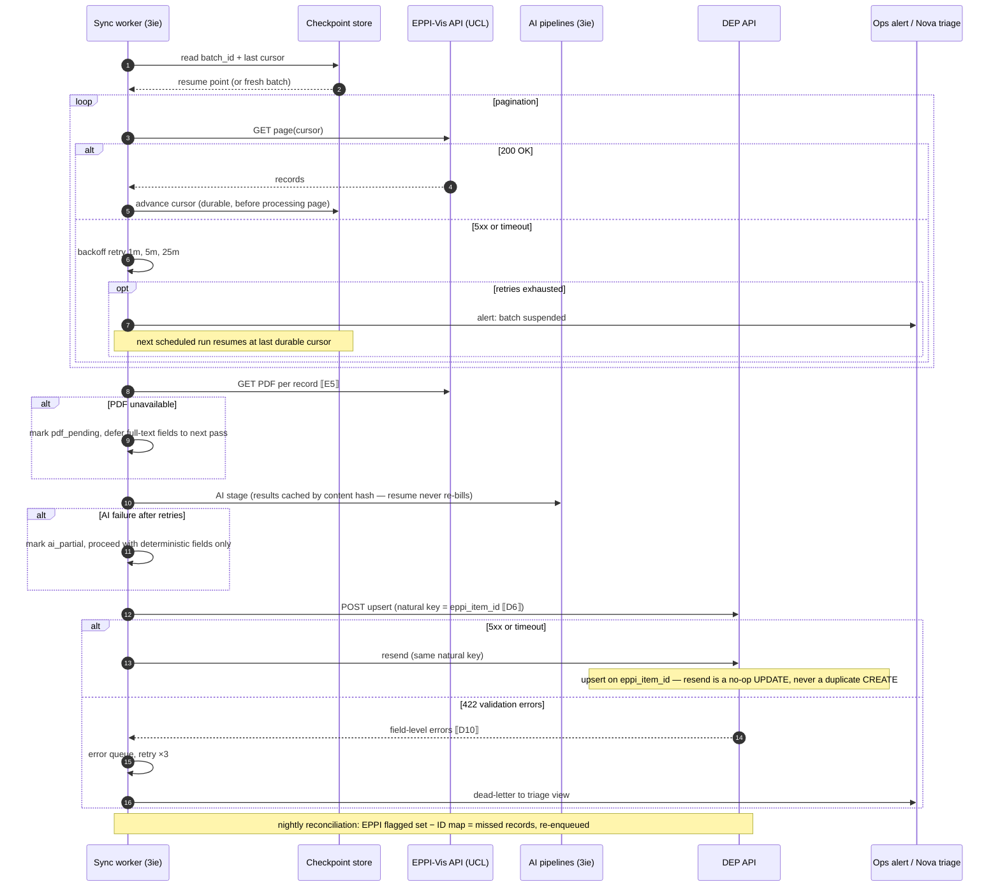
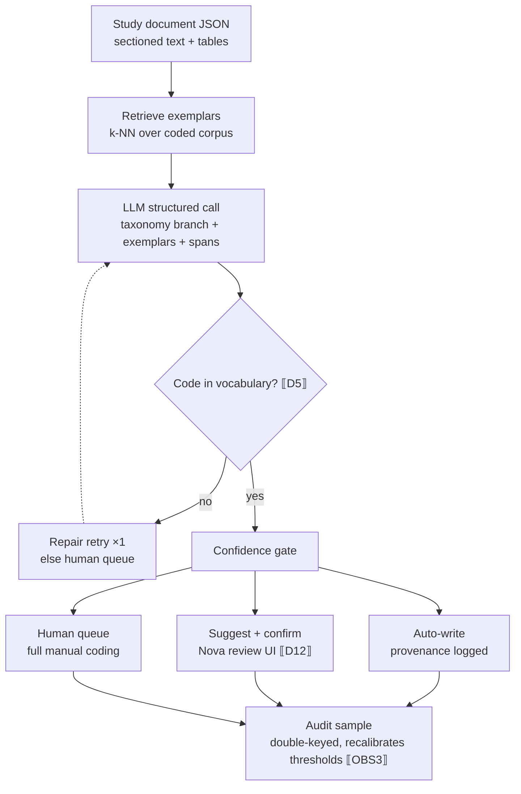

# EPPI ↔ DEP integration spec — v2 (draft with placeholders)

**Basis:** DEP extraction protocol for IE v4 (admin panel) · email-thread agreements with EPPI Centre · METIUS priority 1
**Convention:** every unknown is a `⟦token⟧`. Each token appears once in §6 as a question for the software engineer / EPPI team. Resolve the tokens → the spec is implementation-ready.
**Changes from v1:** transaction boundary corrected (per-record commit; study + ID-map + provenance in one transaction; natural-key idempotency); AI-pipeline failure path added; error model unified on HTTP status; sentinel wire values made canonical; redundant flowcharts (old A.1/A.2) removed; new §8 Security & data handling and §9 Observability. New tokens: E7, D5b, D13–D16, SEC1–SEC2, OBS1–OBS3.

---

## 1. Endpoints

### 1.1 EPPI side (pull)

| # | Item | Value |
|---|---|---|
| E1 | EPPI-Vis API base URL | `⟦E1: base URL + version⟧` |
| E2 | Auth mechanism | `⟦E2: API key / OAuth2 / per-review token? rotation policy?⟧` |
| E3 | List items ready to migrate | `GET ⟦E3: endpoint + which EPPI code/flag marks "FT-included, ready for DEP"⟧` |
| E4 | Item detail (codes + metadata) | `GET ⟦E4: endpoint; does it return assigned codes, studification grouping, screening history?⟧` |
| E5 | Attached PDF download | `GET ⟦E5: endpoint; or are PDFs not retrievable via EPPI-Vis?⟧` |
| E6 | Pagination + rate limits | `⟦E6: page size, cursor vs offset, requests/min⟧` |
| E7 | PDF licence terms | `⟦E7: does licence metadata permit 3ie to store the PDF, or derive-fields-only? per-item or blanket?⟧` |

### 1.2 DEP side (write)

| # | Item | Value |
|---|---|---|
| D1 | DEP API base URL, staging vs prod | `⟦D1: staging environment exists? URL for each⟧` |
| D2 | Protocol | `⟦D2: REST or GraphQL? (RFP mentions both) — pick one for writes⟧` |
| D3 | Service auth | `⟦D3: service account for pipelines; token issuance; Nova user vs API user?⟧` |
| D4 | Study upsert | `POST/PUT ⟦D4: endpoint; upsert semantics or separate create/update?⟧` |
| D5 | Taxonomy code identifiers | `⟦D5: are intervention/outcome codes exposed with stable IDs via API? endpoint to enumerate?⟧` |
| D5a | Common Agencies identifiers | `⟦D5a: Common Agencies list (232 rows) exposed with stable IDs + enumeration endpoint?⟧` |
| D5b | Outlet / institution identifiers | `⟦D5b: publication outlets and author-affiliation institutions exposed with stable IDs + enumeration?⟧` |
| D6 | EPPI↔DEP ID map | `⟦D6: does a mapping table exist? which system owns it? is eppi_item_id the natural upsert key?⟧` |
| D7 | Elasticsearch reindex | `⟦D7: automatic on MySQL write, or explicit trigger endpoint/queue?⟧` |
| D8 | Provenance fields | `⟦D8: can per-field metadata (pipeline, model, confidence, spans) be added to schema? new table?⟧` |
| D9 | PDF/object storage | `⟦D9: where will PDFs live — DEP MySQL blob, S3-style store, drive? keying by study ID?⟧` |
| D13 | Withdrawal semantics | `⟦D13: how does DEP handle a study migrated then later excluded/un-flagged in EPPI — tombstone, retract, or ignore?⟧` |
| D14 | Reviewer-confirmed overwrite | `⟦D14: does DEP track per-field "reviewer-confirmed" state so a later sync can avoid overwriting a human-edited value?⟧` |
| D15 | Payload schema version | `⟦D15: does the write API accept/negotiate a payload schema_version for forward compatibility?⟧` |
| D16 | Sentinel wire strings | `⟦D16: exact wire representation of each sentinel — e.g. "999" vs 999, "NR" vs "Not reported"⟧` |

## 2. Sync payloads (skeletons)

### 2.1 EPPI export item (expected shape — verify against ⟦E4⟧)

```json
{
  "eppi_item_id": "⟦E4a: field name in EPPI-Vis response⟧",
  "study_group_id": "⟦E4b: studification — how are multi-record studies represented?⟧",
  "bibliographic": {
    "title": "...", "authors": ["Last, First M."], "year": 2025,
    "doi": "...", "abstract": "...", "source_db": "...",
    "ris_raw": "⟦E4c: is raw RIS retrievable for cleanup pipeline?⟧"
  },
  "screening": {
    "ta_decision": "include", "ft_decision": "include",
    "classifier_score": "⟦E4d: exposed?⟧",
    "assigned_codes": ["⟦E4e: broad categories assigned in EPPI — code set name?⟧"]
  },
  "pdf_ref": "⟦E5⟧",
  "pdf_licence": "⟦E7⟧"
}
```

### 2.2 DEP study upsert (mirrors admin-panel tabs; see §3 for field map)

One call **per record** (not per batch). Natural key for upsert is `eppi_item_id` ⟦D6⟧; `sync_batch` is for tracing only, never part of the dedup key.

```json
{
  "schema_version": "⟦D15⟧",
  "external_ref": { "eppi_item_id": "…", "sync_batch": "2026-08" },
  "publication": { "title": "…", "language": "…", "authors": [ { "name": "…", "affiliation_institution_id": "⟦D5b⟧", "affiliation_country": "…" } ],
    "outlet_id": "⟦D5b⟧", "year": 2025, "doi": "…", "abstract": "…",
    "open_access": true, "publication_type": "…", "url": "…" },
  "sector": { "sector_wb": "…", "subsectors_wb": ["…"], "theme_wb": "…",
    "dac_primary": "…", "dac_secondary": "…", "crs_voluntary": "…",
    "sdgs": ["…"], "other_topics": ["…"], "first_year_intervention": 2019,
    "equity_focus": ["…"], "equity_dimension": ["…"], "equity_description": "…", "keywords": ["…"] },
  "transparency": { "primary_dataset": {"available": "…", "location": "…", "url": "…", "format": ["…"]},
    "secondary_dataset": {"disclosure": "…", "name": "…", "location": "…"},
    "analysis_code": {"available": "…", "format": "…"},
    "study_materials": ["…"], "registration": {"registered": "…", "registry": "…", "url": "…"},
    "pre_analysis_plan": "…", "ethics_approval": "…" },
  "geographic": { "continent": "…", "countries": ["…"] },
  "methods": { "evaluation_design": "…", "evaluation_method": "…", "mixed_method": false,
    "additional_methods": ["…"], "unit_of_observation": ["…"] },
  "agency": { "project_name": "…",
    "implementing": [{"name_id": "⟦D5a⟧", "category": "auto"}],
    "program_funding": [{"name_id": "⟦D5a⟧"}], "research_funding": [{"name_id": "⟦D5a⟧"}] },
  "findings": { "interventions": [{"taxonomy_code_id": "⟦D5⟧", "description": "…"}],
    "outcomes": [{"taxonomy_code_id": "⟦D5⟧", "description": "…"}] },
  "screening": { "dep_include": true, "screened_by": "⟦S1: value for pipeline-written records — service identity or human owner?⟧",
    "screening_date": "2026-08-01 (⟦S3: is this the sync date, or EPPI's original FT-decision date?⟧)" },
  "sync_flags": { "pdf_pending": false, "ai_partial": false },
  "provenance": [ { "field": "sector.dac_primary", "source": "ai:field-population@⟦V1: version scheme⟧",
      "model": "…", "confidence": 0.93, "spans": ["p.4 §2.1"], "mode": "suggest_confirm",
      "reviewer_action": null } ]
}
```

> `sync_flags.pdf_pending` / `ai_partial` mark records written with deterministic fields only, pending a second pass (see §2.4). `provenance[].reviewer_action: null` is valid — it means "not yet reviewed", and is the one place null is expected (the §4 sentinel rule applies to protocol *data* fields, not audit metadata).

### 2.3 Response envelope + errors

**HTTP status is authoritative**; the body elaborates. Per-record, since each record is its own call.

Success (HTTP 200 update / 201 create):
```json
{ "dep_study_id": "…", "eppi_item_id": "…", "action": "created|updated", "sync_batch": "2026-08" }
```

Validation failure (HTTP 422):
```json
{ "eppi_item_id": "…", "validation_errors": [
  { "field": "sector.crs_voluntary",
    "rule_id": "⟦D10: rule identifier; does the API enforce the DAC→CRS dependency, or must the client?⟧",
    "message": "CRS code must be a child of the selected secondary DAC code" } ] }
```

### 2.4 Sequence: monthly sync, happy path

```mermaid
sequenceDiagram
  autonumber
  participant SCH as Scheduler
  participant SYNC as Sync worker (3ie)
  participant EPPI as EPPI-Vis API (UCL)
  participant AI as AI pipelines (3ie)
  participant DEP as DEP API (staging→prod)
  participant REV as Reviewer (Nova)

  SCH->>SYNC: trigger monthly batch
  loop per page ⟦E6⟧
    SYNC->>EPPI: GET flagged items ⟦E3⟧ (auth ⟦E1/E2⟧)
    EPPI-->>SYNC: records, codes, studify groups ⟦E4⟧
    SYNC->>EPPI: GET attached PDFs ⟦E5⟧ (+ licence ⟦E7⟧)
    EPPI-->>SYNC: PDF binaries + licence metadata
  end
  loop per record — AI stage (results cached by content hash)
    SYNC->>AI: bib cleanup, ingestion, field population, taxonomy
    alt AI success
      AI-->>SYNC: values + confidence + spans
    else AI failure / timeout / rate-limit
      AI-->>SYNC: partial or error
      SYNC->>SYNC: retry w/ backoff; on exhaustion set ai_partial
      Note over SYNC: write deterministic fields now, defer AI fields to next pass
    end
  end
  loop per record
    SYNC->>DEP: POST upsert to staging ⟦D4⟧ (key = eppi_item_id ⟦D6⟧, schema_version ⟦D15⟧)
    DEP->>DEP: validate: schema, sentinels ⟦D16⟧, dependency chains ⟦D10⟧
    alt 422 validation errors
      DEP-->>SYNC: field-level errors
      SYNC->>SYNC: error queue, retry ×3, then dead-letter → Nova triage
    else validation passes
      DEP->>DEP: BEGIN txn → upsert study + ID-map row ⟦D6⟧ + provenance ⟦D8⟧ → COMMIT
      Note over DEP: one transaction: study, EPPI↔DEP map, and provenance commit atomically
      DEP->>DEP: enqueue async Elasticsearch reindex ⟦D7⟧ (post-commit)
      DEP-->>SYNC: dep_study_id
    end
  end
  DEP->>REV: queue suggest-and-confirm fields ⟦D12⟧
  REV->>DEP: accept or edit per field
  DEP->>DEP: provenance reviewer_action updated; field marked confirmed ⟦D14⟧
  opt classifier feedback — separate job, gated on reviewer_action ≠ null
    SYNC->>EPPI: export reviewer-confirmed DEP codes for retraining
    Note over SYNC,EPPI: only human-confirmed codes; never unconfirmed suggestions; never blocks batch
  end
```

Design decisions encoded above:
- **(a) AI pipelines run on the batch in flight**, before the DEP write — one write, complete payload — which makes PDF retrievability from EPPI (⟦E5⟧) the pivotal unknown: if negative, ingestion-dependent fields (Findings, Transparency, most of Sector) move to a second sync pass (`pdf_pending`) after PDFs arrive by another route.
- **(b) Study, ID-map, and provenance commit in one transaction.** In v1 the ID-map and provenance were written *after* the study commit; a crash in between could leave an un-mapped study (which reconciliation would re-create as a duplicate) or a committed AI value with no audit record. Atomic commit removes both hazards.
- **(c) Per-record commit, not batch all-or-nothing.** One poison record must not roll back a 10³-record month; bad records dead-letter individually.
- **(d) Reviewer accept/edit happens after commit** — suggested values land in DEP flagged, not held in limbo, so review lag never blocks the monthly cadence.
- **(e) Classifier feedback is gated on human confirmation** — retraining EPPI's classifier on DEP's own unconfirmed suggestions would be a self-reinforcing loop, so feedback fires from a separate job over `reviewer_action ≠ null` records only.

### 2.5 Sequence: failure and resume path



Failure-mode invariants:
- The cursor checkpoint is written **before** processing each page — a crash never re-processes silently.
- Idempotency rests on the **`eppi_item_id` natural-key upsert**: a resend UPDATEs rather than CREATEs. Because the ID-map row commits in the same transaction as the study (§2.4b), reconciliation never sees a committed-but-unmapped study, so it never re-creates a duplicate — the v1 duplicate-study race is closed.
- Provenance rows are keyed `(dep_study_id, field_path, sync_batch)` and upserted, so a resend replaces rather than appends duplicate audit rows. If the DEP API also supports an idempotency-key header (⟦Q20⟧), send `eppi_item_id + content_hash` to dedupe side effects belt-and-braces.
- AI results are **cached by content hash**, so resuming a partly-processed batch does not re-invoke (or re-pay for) the LLM.
- `pdf_pending` / `ai_partial` degrade gracefully — the record commits with what it has, and a later pass fills the deferred fields.
- Nightly reconciliation is the safety net catching anything all mechanisms miss.

## 3. Field map: protocol → payload → automation mode

Cardinality: 1 = one answer · N = repeatable. Req: R = data required · C = conditional/sentinel · A = auto-populated · – = leave blank (deprecated, excluded from payload).
Mode: **AUTO** = fully automated write · **S+C** = suggest-and-confirm in Nova · **HITL** = human · **PASS** = passed through from EPPI/bib source · **AUTO\*** = currently S+C, graduates to AUTO once the prototype passes its accuracy eval (a rollout state, not a distinct write mode).
Sentinel shorthand in the Req column (`"999"`, `"NR"`, `"NS"`, `"NA"`, `"No DOI"`, `"No abstract"`) maps to canonical wire strings defined in §4 ⟦D16⟧ — never write null where a sentinel is defined.

### Publication tab

| Field | Card | Req | Vocabulary | Source | Mode |
|---|---|---|---|---|---|
| Source project | 1 | R | project list ⟦D11: enumerable via API?⟧ | sync config | AUTO |
| Title / Foreign title | 1/N | R/C | free | EPPI + bib cleanup | AUTO |
| Study status | 1 | R | 3 options | EPPI code ⟦E4e⟧ | AUTO |
| Language | 1 | R | 5 options | AI detect | AUTO |
| Author name | N | R | free, "Last, First" | bib cleanup | AUTO |
| Author affiliation institution | N | R("999") | institution list ⟦D5b⟧ | AI field-population | S+C |
| Author affiliation dept | N | R("999") | free | AI field-population | S+C |
| Author affiliation country | N | R("NR") | country list | AI (prototyped) | AUTO\* |
| Publication outlet (+Other) | 1 | C | outlet list ⟦D5b⟧ | bib cleanup + fuzzy | AUTO |
| Volume / Issue / Pages | 1 | C | free | bib cleanup | AUTO |
| Year of publication | 1 | R("999") | year list | bib cleanup | AUTO |
| DOI | 1 | R("No DOI") | free | bib cleanup (Crossref) | AUTO |
| Abstract | 1 | R("No abstract") | free | EPPI record | PASS |
| Open access | 1 | R | Y/N | Unpaywall/OpenAlex lookup | AUTO |
| 3ie produced | 1 | R | always "No" | constant | AUTO |
| Publication type | 1 | R | type list | AI classify | S+C |
| Publication URL | 1 | C | free | bib cleanup | AUTO |
| Other resources (linked pubs) | 1 | C | study IDs | dedup/link detection | HITL |
| Minutes (per tab, ×6) | 1 | R | numeric | ⟦S2: semantics for pipeline-coded tabs — 0, null, or machine time?⟧ | AUTO |

### Sector tab

| Field | Card | Req | Vocabulary | Source | Mode |
|---|---|---|---|---|---|
| Sector name (WB) | 1 | R | WB sector list | AI classify | S+C |
| Sub-sector name (WB) | N | R | dependent on sector | AI classify | S+C |
| Primary theme + sub-theme (WB) | 1/N | R | WB theme taxonomy | AI classify | S+C |
| Additional theme/sub-theme | 1/N | C | WB theme taxonomy | AI classify | S+C |
| Primary/secondary DAC + CRS | 1 each | R | DAC5/CRS, dependent ⟦D10⟧ | AI classify | S+C |
| Additional DAC sets | N | C | as above | AI classify | S+C |
| UN SDGs | N | R | SDG list | AI classify | S+C |
| Other topics | N | R("NA") | topics list (defs sheet) | AI classify | S+C |
| First year of intervention | 1 | R("NS") | year | AI extract from FT | S+C |
| Equity focus / dimension | N | R (auto-dependency) | option lists | AI classify | S+C |
| Equity description | 1 | R (auto-dependency) | free, quoted from study | AI extract + spans | S+C |
| Keywords | N | R | author-provided | PDF ingestion | AUTO |

### Transparency tab

| Field | Card | Req | Vocabulary | Source | Mode |
|---|---|---|---|---|---|
| Primary dataset available / location / URL / format | 1/1/1/N | R + auto-deps | option lists + free | AI extract from FT | S+C |
| Secondary dataset disclosure / name / location / additional | 1/1/1/N | R + auto-deps | free | AI extract | S+C |
| Analysis code availability / format (+other) | 1/1 | R | format list | AI extract | S+C |
| Study materials available / list / other | 1/N/N | R | materials list | AI extract | S+C |
| Study registration / registry / URL | 1/1/1 | R("NA") | registry list | AI extract + registry lookup ⟦V2: which registries scriptable?⟧ | S+C |
| Pre-analysis plan / ethics approval | 1/1 | R | Y/N | AI extract | S+C |

### Geographic tab

| Field | Card | Req | Vocabulary | Source | Mode |
|---|---|---|---|---|---|
| Continent | N | R | 6-region list | derived from country | AUTO |
| Country name | N | R | country list (+Multi-country) | AI extract (prototyped) | AUTO\* |
| Income level / FCV | – | A | WB classifications | DEP auto-populates | n/a |
| Region…Location name | – | – | deprecated | excluded | n/a |

### Methods tab

| Field | Card | Req | Vocabulary | Source | Mode |
|---|---|---|---|---|---|
| Evaluation design | 1 | R | Experimental / Quasi / Other | AI classify | S+C |
| Evaluation method | 1 | R | RCT · natural experiment · RDD · IV · DiD/FE/TWM · ITS · matching · synthetic control (Methods sheet defs) | AI classify | S+C |
| Mixed method | 1 | R | Y/N | AI classify | S+C |
| Additional methods 1–2 | 1 each | R("NA") | method list incl. qual (QCA, process tracing…) | AI classify | S+C |
| Unit of observation | N | R | level list | AI extract | S+C |

### Agency tab

| Field | Card | Req | Vocabulary | Source | Mode |
|---|---|---|---|---|---|
| Project name | 1 | R("NS") | free | AI extract | S+C |
| Implementing agency name / category | N | R("NS") | Common Agencies list (232 rows, category auto) ⟦D5a⟧ | AI + fuzzy match (prototyped pattern) | S+C |
| Program funding agency name / category | N | R("NS") | as above ⟦D5a⟧ | AI + fuzzy | S+C |
| Research funding agency name / category | N | R("NS") | as above ⟦D5a⟧ | AI + fuzzy | S+C |

### Findings tab

| Field | Card | Req | Vocabulary | Source | Mode |
|---|---|---|---|---|---|
| Intervention (DEP taxonomy) | N | R | intervention taxonomy ⟦D5⟧ | taxonomy classifier (RAG) | S+C |
| Intervention description | 1 | R | free, ≤1 paragraph, page refs | AI extract + spans | S+C |
| Outcome (DEP taxonomy) | N | R | outcome taxonomy ⟦D5⟧ | taxonomy classifier | S+C |
| Outcome description | N | R | author's words, page refs | AI extract + spans | S+C |
| Indicator / subgroup / direction / significance / effect size | – | – | not extracted for DEP | excluded (EGM custom fields live here later) | n/a |

### Screening tab

| Field | Card | Req | Vocabulary | Source | Mode |
|---|---|---|---|---|---|
| DEP include | 1 | R | Y/N | EPPI FT decision | PASS |
| Exclusion reason (+open) | 1 | A | reason list | auto | n/a |
| Screened by / date | 1 | R | free/date | ⟦S1⟧ / ⟦S3⟧ | AUTO |

## 4. Validation rules the client must enforce (unless API does — ⟦D10⟧)

Dependency chains from the protocol: sub-sector ⊂ sector; sub-theme ⊂ theme; CRS ⊂ secondary DAC ⊂ primary DAC; equity dimension/description auto-set to "Not applicable" when equity focus = "Does not address"; dataset sub-fields auto-set when "Does not use primary/secondary data"; agency category auto-populates from Common Agencies unless "Other".

**Sentinel values are semantically required** — never write null where a sentinel is defined for a protocol *data* field. The shorthand used in §3 maps to canonical wire strings (exact form to be confirmed ⟦D16⟧):

| Meaning | §3 shorthand | Canonical wire value ⟦D16⟧ | Typical fields |
|---|---|---|---|
| Not reported | NR | `"Not reported"` | affiliation country |
| Not specified | NS | `"Not specified"` | first year, project name, agencies |
| Not applicable | NA | `"Not applicable"` | other topics, additional methods, registration |
| Numeric-not-available | 999 | `"999"` | affiliation institution/dept, year |
| No DOI | — | `"No DOI"` | DOI |
| No abstract | — | `"No abstract"` | abstract |

## 5. Provenance & modes (applies to every AI-written field)

Per-field record: `{pipeline, model+version ⟦V1⟧, confidence, spans, mode, reviewer_action, timestamp}`, keyed `(dep_study_id, field_path, sync_batch)` so resends upsert rather than duplicate. Confidence thresholds per field start conservative (everything S+C except deterministic bib fields) and are recalibrated from the double-keyed audit sample (§9). Nova is the review surface — needs an "AI-suggested" filter view ⟦D12: Nova customisation feasible in-house or via developer?⟧. When a reviewer confirms/edits a field, DEP marks it reviewer-confirmed so a later sync does not overwrite it ⟦D14⟧.

## 6. Questionnaire for the software engineer(s)

**EPPI Centre (UCL) — resolves E-tokens**
1. E1–E2: EPPI-Vis base URL, versioning, and auth model for a 3ie service integration; token rotation.
2. E3: which code/flag combination identifies "full-text included, ready to migrate", and can we filter server-side?
3. E4: full response schema for item detail — codes, studification grouping (E4b), classifier score (E4d), broad category code-set names (E4e); is raw RIS retrievable (E4c)?
4. E5: are attached PDFs downloadable via API, and what licensing metadata travels with them?
5. E6: pagination model and rate limits for a ~monthly batch of 10²–10³ records.
6. E7: do PDF licence terms permit 3ie to *store* the PDF, or only derive fields from it? Is the constraint per-item or blanket?

**DEP developer — resolves D-tokens**
7. D1–D3: staging environment; REST vs GraphQL for writes; service-account auth separate from Nova users.
8. D4: study create/update semantics — is upsert supported, is `eppi_item_id` the natural key, what happens on re-submission of the same record?
9. D5 / D5a / D5b: stable IDs and an enumeration endpoint for each controlled vocabulary — intervention/outcome taxonomy nodes (D5), Common Agencies (D5a), outlets and affiliation institutions (D5b); needed by the fuzzy-match layer.
10. D6: EPPI-item-ID ↔ DEP-study-ID map — exists? where should it live (new MySQL table proposed)? Is it written in the same transaction as the study?
11. D7: MySQL→Elasticsearch sync mechanism — trigger, queue, or manual reindex?
12. D8: schema change for per-field provenance — feasible as a side table keyed (study_id, field_path, sync_batch)?
13. D9: PDF storage decision — location, keying, access control, copyright constraints (see E7).
14. D10: which dependency/validation rules (§4) are enforced server-side today vs assumed of the Nova user? Machine-readable rule IDs in 422 responses?
15. D11: are "Source project" and other admin lists API-enumerable?
16. D12: Nova customisation path for the suggest-and-confirm review view.
17. D13: how does DEP handle a study migrated then later excluded/un-flagged in EPPI — tombstone, retract, or ignore?
18. D14: does DEP track a per-field "reviewer-confirmed" flag so a later sync can skip overwriting human-edited values?
19. D15: does the write API accept/negotiate a payload `schema_version`?
20. D16: exact wire representation of each sentinel (§4 table).

**Joint / process — resolves S- and V-tokens**
21. S1: identity convention for machine-written `Screened by` (audit requirement).
22. S2: `Minutes` semantics for pipeline-coded tabs (these fields feed cost tracking — proposal: log machine wall-time separately, human review minutes in the existing field).
23. S3: does `screening_date` carry the sync date or EPPI's original FT-decision date?
24. V1: model/pipeline version scheme for provenance.
25. V2: which trial/study registries can be queried programmatically for the registration lookup.
26. Q20 (extended, from §2.5): does the DEP API support an idempotency-key header in addition to natural-key upsert, and what is the machine-readable format of 422 validation errors (field path + rule ID)?

**Security & operations — resolves SEC- and OBS-tokens (see §8, §9)**
27. SEC1: is a data-sharing / data-processing agreement in place with UCL covering author PII and PDF full text?
28. SEC2: agreed retention period for PII held in checkpoint store, error queue, and dead-letter view.
29. OBS1: target completion window / SLO for a monthly batch.
30. OBS2: alerting channel and thresholds (dead-letter rate, reconciliation delta, AI parse-failure spike).
31. OBS3: double-keyed audit sample — size, cadence, and owner.

## 7. Out of scope here

EGM custom fields (crosswalk spec per map — separate document once the pilot map is chosen); LLM screening prompts; PDF ingestion internals (MinerU/Grobid merge — separate flowchart on request).

## 8. Security & data handling

**PII inventory.** Author names, affiliations, and departments are personal data under UK GDPR (UCL is the source), as is any personal data inside PDF full text. This governs every store the pipeline touches.

- **Data-sharing agreement.** A DPA/data-sharing agreement with UCL must cover author PII and PDF full text before production sync ⟦SEC1⟧.
- **Transport.** TLS 1.2+ in both directions (EPPI pull, DEP write). Auth tokens (⟦E2⟧, ⟦D3⟧) live in a secrets manager — never in config files, the repo, or logs — with the rotation policy from E2/D3.
- **At rest.** The checkpoint store, error queue, dead-letter view, and any cached AI inputs/outputs will contain PII and PDF-derived text; encrypt at rest and access-control them.
- **PII in logs.** Log `eppi_item_id`, `sync_batch`, and field *paths* — never field *values* (names, affiliations, quoted spans) at INFO level. Redact PII from error payloads before they reach the dead-letter view.
- **PDF copyright.** Licence metadata (⟦E7⟧) governs whether 3ie may store the PDF (⟦D9⟧) or must derive-fields-only and discard the binary. Retention of stored PDFs aligns to the licence.
- **Retention.** PII in checkpoint/error/dead-letter stores is purged after an agreed window ⟦SEC2⟧; provenance (audit) is retained per the audit policy.
- **Least privilege.** The sync service account (⟦D3⟧) is scoped to the write endpoints only; the ID-map and provenance tables are access-controlled.
- **Org constraint.** No PII appears in any external upload or shared artifact produced by this pipeline.

## 9. Observability & SLOs

**Per-batch metrics.** Records pulled · transformed · AI success / partial / failed · committed · dead-lettered · `pdf_pending` · `ai_partial` · reconciliation delta.

**AI health.** Confidence distribution per field and drift vs. baseline; structured-output parse-failure rate; taxonomy repair-retry rate (Appendix A); per-record token count and cost.

**SLOs.** Batch completes within the agreed window ⟦OBS1⟧; dead-letter rate below threshold; reconciliation delta trending to zero month over month.

**Alerting** (to OPS channel ⟦OBS2⟧): batch suspended (retries exhausted), dead-letter rate breach, reconciliation delta over threshold, AI parse-failure or confidence-drop spike.

**Tracing.** Correlate every record by `eppi_item_id + sync_batch` across the EPPI pull, AI stage, and DEP write.

**Audit loop.** The double-keyed sample ⟦OBS3⟧ (size, cadence, owner) compares pipeline output against independent human coding and feeds the per-field confidence-threshold recalibration in §5.

---

## Appendix A — Taxonomy classifier runtime (per study)


