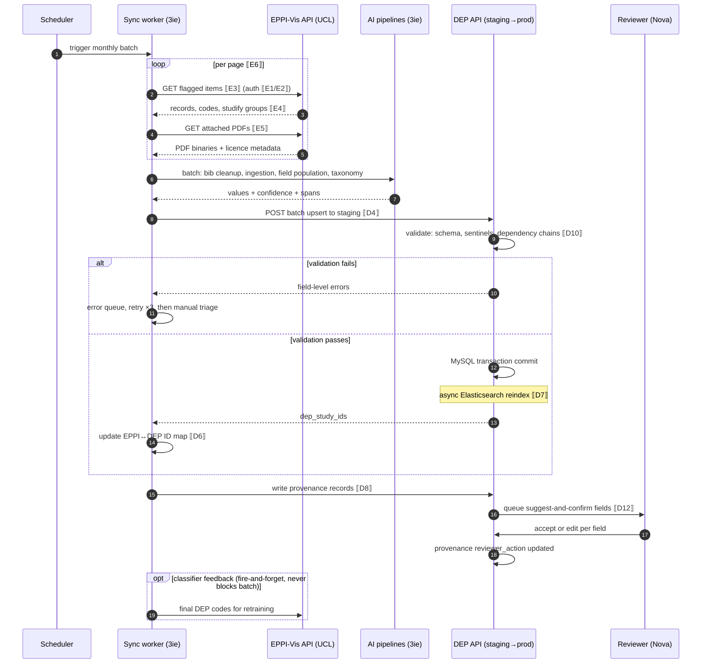
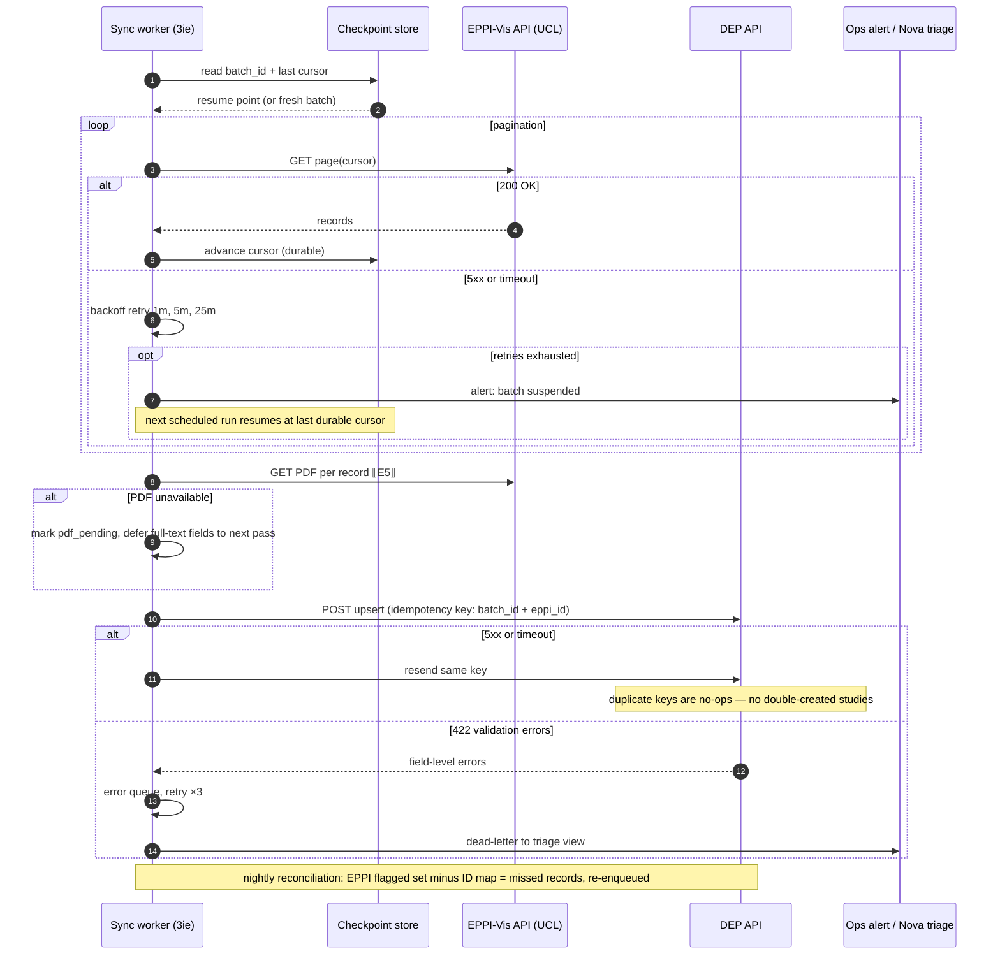
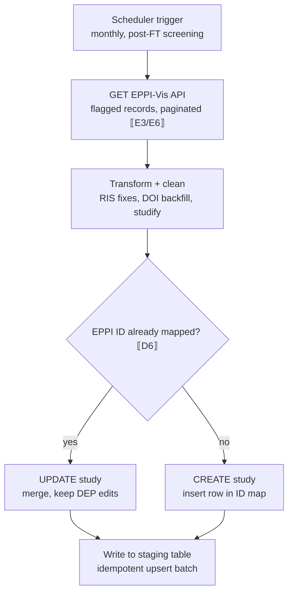
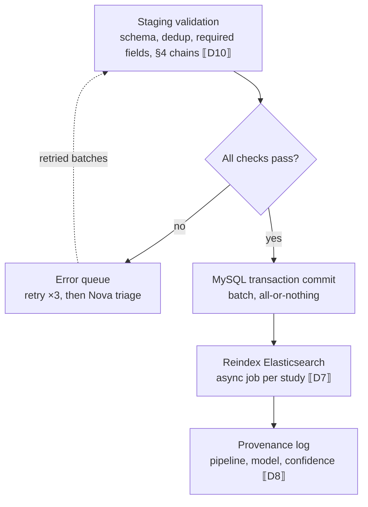
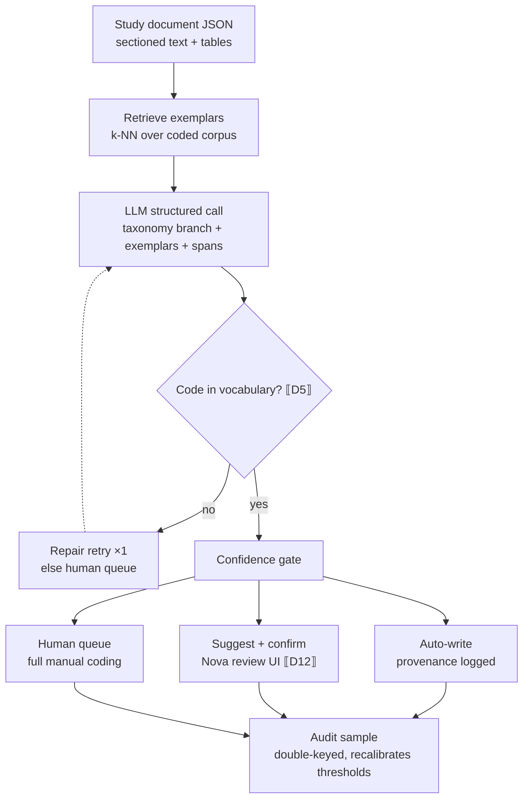

# EPPI ↔ DEP integration spec (draft with placeholders)

**Basis:** DEP extraction protocol for IE v4 (admin panel) · email-thread agreements with EPPI Centre · METIUS priority 1
**Convention:** every unknown is a `⟦token⟧`. Each token appears once in §6 as a question for the software engineer / EPPI team. Resolve the tokens → the spec is implementation-ready.

---

## 1. Endpoints

### 1.1 EPPI side (pull)

| # | Item | Value |
|---|---|---|
| E1 | EPPI-Vis API base URL | `⟦E1: base URL + version⟧` |
| E2 | Auth mechanism | `⟦E2: API key / OAuth2 / per-review token? rotation policy?⟧` |
| E3 | List items ready to migrate | `GET ⟦E3: endpoint + which EPPI code/flag marks "FT-included, ready for DEP"⟧` |
| E4 | Item detail (codes + metadata) | `GET ⟦E4: endpoint; does it return assigned codes, studification grouping, screening history?⟧` |
| E5 | Attached PDF download | `GET ⟦E5: endpoint; or are PDFs not retrievable via EPPI-Vis?⟧` |
| E6 | Pagination + rate limits | `⟦E6: page size, cursor vs offset, requests/min⟧` |

### 1.2 DEP side (write)

| # | Item | Value |
|---|---|---|
| D1 | DEP API base URL, staging vs prod | `⟦D1: staging environment exists? URL for each⟧` |
| D2 | Protocol | `⟦D2: REST or GraphQL? (RFP mentions both) — pick one for writes⟧` |
| D3 | Service auth | `⟦D3: service account for pipelines; token issuance; Nova user vs API user?⟧` |
| D4 | Study upsert | `POST/PUT ⟦D4: endpoint; upsert semantics or separate create/update?⟧` |
| D5 | Taxonomy code identifiers | `⟦D5: are intervention/outcome codes exposed with stable IDs via API? endpoint to enumerate?⟧` |
| D6 | EPPI↔DEP ID map | `⟦D6: does a mapping table exist? which system owns it?⟧` |
| D7 | Elasticsearch reindex | `⟦D7: automatic on MySQL write, or explicit trigger endpoint/queue?⟧` |
| D8 | Provenance fields | `⟦D8: can per-field metadata (pipeline, model, confidence, spans) be added to schema? new table?⟧` |
| D9 | PDF/object storage | `⟦D9: where will PDFs live — DEP MySQL blob, S3-style store, drive? keying by study ID?⟧` |

## 2. Sync payloads (skeletons)

### 2.1 EPPI export item (expected shape — verify against ⟦E4⟧)

```json
{
  "eppi_item_id": "⟦E4a: field name in EPPI-Vis response⟧",
  "study_group_id": "⟦E4b: studification — how are multi-record studies represented?⟧",
  "bibliographic": {
    "title": "...", "authors": ["Last, First M."], "year": 2025,
    "doi": "...", "abstract": "...", "source_db": "...",
    "ris_raw": "⟦E4c: is raw RIS retrievable for cleanup pipeline?⟧"
  },
  "screening": {
    "ta_decision": "include", "ft_decision": "include",
    "classifier_score": "⟦E4d: exposed?⟧",
    "assigned_codes": ["⟦E4e: broad categories assigned in EPPI — code set name?⟧"]
  },
  "pdf_ref": "⟦E5⟧"
}
```

### 2.2 DEP study upsert (mirrors admin-panel tabs; see §3 for field map)

```json
{
  "external_ref": { "eppi_item_id": "…", "sync_batch": "2026-08" },
  "publication": { "title": "…", "language": "…", "authors": [ { "name": "…", "affiliation_institution_id": "⟦D5⟧", "affiliation_country": "…" } ],
    "outlet_id": "…", "year": 2025, "doi": "…", "abstract": "…",
    "open_access": true, "publication_type": "…", "url": "…" },
  "sector": { "sector_wb": "…", "subsectors_wb": ["…"], "theme_wb": "…",
    "dac_primary": "…", "dac_secondary": "…", "crs_voluntary": "…",
    "sdgs": ["…"], "other_topics": ["…"], "first_year_intervention": 2019,
    "equity_focus": ["…"], "equity_dimension": ["…"], "equity_description": "…", "keywords": ["…"] },
  "transparency": { "primary_dataset": {"available": "…", "location": "…", "url": "…", "format": ["…"]},
    "secondary_dataset": {"disclosure": "…", "name": "…", "location": "…"},
    "analysis_code": {"available": "…", "format": "…"},
    "study_materials": ["…"], "registration": {"registered": "…", "registry": "…", "url": "…"},
    "pre_analysis_plan": "…", "ethics_approval": "…" },
  "geographic": { "continent": "…", "countries": ["…"] },
  "methods": { "evaluation_design": "…", "evaluation_method": "…", "mixed_method": false,
    "additional_methods": ["…"], "unit_of_observation": ["…"] },
  "agency": { "project_name": "…",
    "implementing": [{"name_id": "⟦D5a: Common Agencies list exposed with IDs?⟧", "category": "auto"}],
    "program_funding": [{"name_id": "…"}], "research_funding": [{"name_id": "…"}] },
  "findings": { "interventions": [{"taxonomy_code_id": "⟦D5⟧", "description": "…"}],
    "outcomes": [{"taxonomy_code_id": "⟦D5⟧", "description": "…"}] },
  "screening": { "dep_include": true, "screened_by": "⟦S1: value for pipeline-written records — service identity or human owner?⟧", "screening_date": "2026-08-01" },
  "provenance": [ { "field": "sector.dac_primary", "source": "ai:field-population@⟦V1: version scheme⟧",
      "model": "…", "confidence": 0.93, "spans": ["p.4 §2.1"], "mode": "suggest_confirm",
      "reviewer_action": null } ]
}
```

### 2.3 Response envelope + errors

```json
{ "status": "accepted|rejected", "dep_study_id": "…", "validation_errors": [
  { "field": "sector.crs_voluntary", "rule": "⟦D10: does the API enforce DAC→CRS dependency, or must the client?⟧" } ] }
```

### 2.4 Sequence: monthly sync, happy path



Design decisions encoded above: (a) AI pipelines run on the batch **in flight**, before the DEP write — one write, complete payload — which makes PDF retrievability from EPPI (⟦E5⟧) the pivotal unknown: if negative, ingestion-dependent fields (Findings, Transparency, most of Sector) move to a second sync pass after PDFs arrive by another route. (b) Reviewer accept/edit happens **after** commit — suggested values land in the DEP flagged, not held in limbo, so review lag never blocks the monthly cadence.

### 2.5 Sequence: failure and resume path



Failure-mode invariants: the cursor checkpoint is written **before** processing each page (a crash never re-processes silently); the idempotency key makes resends safe end-to-end; `pdf_pending` degrades gracefully instead of failing the record; and the reconciliation job is the safety net that catches anything both mechanisms miss.

## 3. Field map: protocol → payload → automation mode

Cardinality: 1 = one answer · N = repeatable. Req: R = data required · C = conditional/sentinel ("999"/"Not applicable") · A = auto-populated · – = leave blank (deprecated, excluded from payload).
Mode: **AUTO** = fully automated write · **S+C** = suggest-and-confirm in Nova · **HITL** = human · **PASS** = passed through from EPPI/bib source.

### Publication tab

| Field | Card | Req | Vocabulary | Source | Mode |
|---|---|---|---|---|---|
| Source project | 1 | R | project list ⟦D11: enumerable via API?⟧ | sync config | AUTO |
| Title / Foreign title | 1/N | R/C | free | EPPI + bib cleanup | AUTO |
| Study status | 1 | R | 3 options | EPPI code ⟦E4e⟧ | AUTO |
| Language | 1 | R | 5 options | AI detect | AUTO |
| Author name | N | R | free, "Last, First" | bib cleanup | AUTO |
| Author affiliation institution | N | R("999") | institution list | AI field-population | S+C |
| Author affiliation dept | N | R("999") | free | AI field-population | S+C |
| Author affiliation country | N | R("NR") | country list | AI (prototyped) | AUTO after eval |
| Publication outlet (+Other) | 1 | C | outlet list | bib cleanup + fuzzy | AUTO |
| Volume / Issue / Pages | 1 | C | free | bib cleanup | AUTO |
| Year of publication | 1 | R("999") | year list | bib cleanup | AUTO |
| DOI | 1 | R("No DOI") | free | bib cleanup (Crossref) | AUTO |
| Abstract | 1 | R("No abstract") | free | EPPI record | PASS |
| Open access | 1 | R | Y/N | Unpaywall/OpenAlex lookup | AUTO |
| 3ie produced | 1 | R | always "No" | constant | AUTO |
| Publication type | 1 | R | type list | AI classify | S+C |
| Publication URL | 1 | C | free | bib cleanup | AUTO |
| Other resources (linked pubs) | 1 | C | study IDs | dedup/link detection | HITL |
| Minutes (per tab, ×6) | 1 | R | numeric | ⟦S2: semantics for pipeline-coded tabs — 0, null, or machine time?⟧ | AUTO |

### Sector tab

| Field | Card | Req | Vocabulary | Source | Mode |
|---|---|---|---|---|---|
| Sector name (WB) | 1 | R | WB sector list | AI classify | S+C |
| Sub-sector name (WB) | N | R | dependent on sector | AI classify | S+C |
| Primary theme + sub-theme (WB) | 1/N | R | WB theme taxonomy | AI classify | S+C |
| Additional theme/sub-theme | 1/N | C | WB theme taxonomy | AI classify | S+C |
| Primary/secondary DAC + CRS | 1 each | R | DAC5/CRS, dependent ⟦D10⟧ | AI classify | S+C |
| Additional DAC sets | N | C | as above | AI classify | S+C |
| UN SDGs | N | R | SDG list | AI classify | S+C |
| Other topics | N | R("NA") | topics list (defs sheet) | AI classify | S+C |
| First year of intervention | 1 | R("NS") | year | AI extract from FT | S+C |
| Equity focus / dimension | N | R (auto-dependency) | option lists | AI classify | S+C |
| Equity description | 1 | R (auto-dependency) | free, quoted from study | AI extract + spans | S+C |
| Keywords | N | R | author-provided | PDF ingestion | AUTO |

### Transparency tab

| Field | Card | Req | Vocabulary | Source | Mode |
|---|---|---|---|---|---|
| Primary dataset available / location / URL / format | 1/1/1/N | R + auto-deps | option lists + free | AI extract from FT | S+C |
| Secondary dataset disclosure / name / location / additional | 1/1/1/N | R + auto-deps | free | AI extract | S+C |
| Analysis code availability / format (+other) | 1/1 | R | format list | AI extract | S+C |
| Study materials available / list / other | 1/N/N | R | materials list | AI extract | S+C |
| Study registration / registry / URL | 1/1/1 | R("NA") | registry list | AI extract + registry lookup ⟦V2: which registries scriptable?⟧ | S+C |
| Pre-analysis plan / ethics approval | 1/1 | R | Y/N | AI extract | S+C |

### Geographic tab

| Field | Card | Req | Vocabulary | Source | Mode |
|---|---|---|---|---|---|
| Continent | N | R | 6-region list | derived from country | AUTO |
| Country name | N | R | country list (+Multi-country) | AI extract (prototyped) | AUTO after eval |
| Income level / FCV | – | A | WB classifications | DEP auto-populates | n/a |
| Region…Location name | – | – | deprecated | excluded | n/a |

### Methods tab

| Field | Card | Req | Vocabulary | Source | Mode |
|---|---|---|---|---|---|
| Evaluation design | 1 | R | Experimental / Quasi / Other | AI classify | S+C |
| Evaluation method | 1 | R | RCT · natural experiment · RDD · IV · DiD/FE/TWM · ITS · matching · synthetic control (Methods sheet defs) | AI classify | S+C |
| Mixed method | 1 | R | Y/N | AI classify | S+C |
| Additional methods 1–2 | 1 each | R("NA") | method list incl. qual (QCA, process tracing…) | AI classify | S+C |
| Unit of observation | N | R | level list | AI extract | S+C |

### Agency tab

| Field | Card | Req | Vocabulary | Source | Mode |
|---|---|---|---|---|---|
| Project name | 1 | R("NS") | free | AI extract | S+C |
| Implementing agency name / category | N | R("NS") | Common Agencies list (232 rows, category auto) ⟦D5a⟧ | AI + fuzzy match (prototyped pattern) | S+C |
| Program funding agency name / category | N | R("NS") | as above | AI + fuzzy | S+C |
| Research funding agency name / category | N | R("NS") | as above | AI + fuzzy | S+C |

### Findings tab

| Field | Card | Req | Vocabulary | Source | Mode |
|---|---|---|---|---|---|
| Intervention (DEP taxonomy) | N | R | intervention taxonomy ⟦D5⟧ | taxonomy classifier (RAG) | S+C |
| Intervention description | 1 | R | free, ≤1 paragraph, page refs | AI extract + spans | S+C |
| Outcome (DEP taxonomy) | N | R | outcome taxonomy ⟦D5⟧ | taxonomy classifier | S+C |
| Outcome description | N | R | author's words, page refs | AI extract + spans | S+C |
| Indicator / subgroup / direction / significance / effect size | – | – | not extracted for DEP | excluded (EGM custom fields live here later) | n/a |

### Screening tab

| Field | Card | Req | Vocabulary | Source | Mode |
|---|---|---|---|---|---|
| DEP include | 1 | R | Y/N | EPPI FT decision | PASS |
| Exclusion reason (+open) | 1 | A | reason list | auto | n/a |
| Screened by / date | 1 | R | free/date | ⟦S1⟧ | AUTO |

## 4. Validation rules the client must enforce (unless API does — ⟦D10⟧)

Dependency chains from the protocol: sub-sector ⊂ sector; sub-theme ⊂ theme; CRS ⊂ secondary DAC ⊂ primary DAC; equity dimension/description auto-set to "Not applicable" when equity focus = "Does not address"; dataset sub-fields auto-set when "Does not use primary/secondary data"; agency category auto-populates from Common Agencies unless "Other". Sentinel values ("999", "Not reported", "Not specified", "No DOI", "No abstract", "Not applicable") are semantically required — never write null where a sentinel is defined.

## 5. Provenance & modes (applies to every AI-written field)

Per-field record: `{pipeline, model+version ⟦V1⟧, confidence, spans, mode, reviewer_action, timestamp}`. Confidence thresholds per field start conservative (everything S+C except deterministic bib fields) and are recalibrated from the double-keyed audit sample. Nova is the review surface — needs an "AI-suggested" filter view ⟦D12: Nova customisation feasible in-house or via developer?⟧.

## 6. Questionnaire for the software engineer(s)

**EPPI Centre (UCL) — resolves E-tokens**
1. E1–E2: EPPI-Vis base URL, versioning, and auth model for a 3ie service integration; token rotation.
2. E3: which code/flag combination identifies "full-text included, ready to migrate", and can we filter server-side?
3. E4: full response schema for item detail — codes, studification grouping (E4b), classifier score (E4d), broad category code-set names (E4e); is raw RIS retrievable (E4c)?
4. E5: are attached PDFs downloadable via API, and what licensing metadata travels with them?
5. E6: pagination model and rate limits for a ~monthly batch of 10²–10³ records.

**DEP developer — resolves D-tokens**
6. D1–D3: staging environment; REST vs GraphQL for writes; service-account auth separate from Nova users.
7. D4: study create/update semantics — is upsert supported, what is the natural key, what happens on re-submission of the same batch (idempotency)?
8. D5/D5a: stable IDs for intervention/outcome taxonomy nodes, outlets, institutions, Common Agencies — and an enumeration endpoint for each controlled vocabulary (needed by the fuzzy-match layer).
9. D6: EPPI-item-ID ↔ DEP-study-ID map — exists? where should it live (new MySQL table proposed)?
10. D7: MySQL→Elasticsearch sync mechanism — trigger, queue, or manual reindex?
11. D8: schema change for per-field provenance — feasible as a side table keyed (study_id, field_path)?
12. D9: PDF storage decision — location, keying, access control, copyright constraints.
13. D10: which dependency/validation rules (§4) are enforced server-side today vs assumed of the Nova user?
14. D11: are "Source project" and other admin lists API-enumerable?
15. D12: Nova customisation path for the suggest-and-confirm review view.

**Joint / process — resolves S- and V-tokens**
16. S1: identity convention for machine-written `Screened by` (audit requirement).
17. S2: `Minutes` semantics for pipeline-coded tabs (these fields feed cost tracking — proposal: log machine wall-time separately, human review minutes in the existing field).
18. V1: model/pipeline version scheme for provenance.
19. V2: which trial/study registries can be queried programmatically for the registration lookup.
20. D4 (extended, from §2.5): does the DEP API support an idempotency-key header (or equivalent natural-key upsert), and what is the machine-readable format of 422 validation errors (field path + rule ID)?

## 7. Out of scope here

EGM custom fields (crosswalk spec per map — separate document once the pilot map is chosen); LLM screening prompts; PDF ingestion internals (MinerU/Grobid merge — separate flowchart on request).

---

## Appendix A — Process flowcharts

### A.1 Sync: pull and transform



### A.2 Sync: validate and commit



### A.3 Taxonomy classifier runtime (per study)


